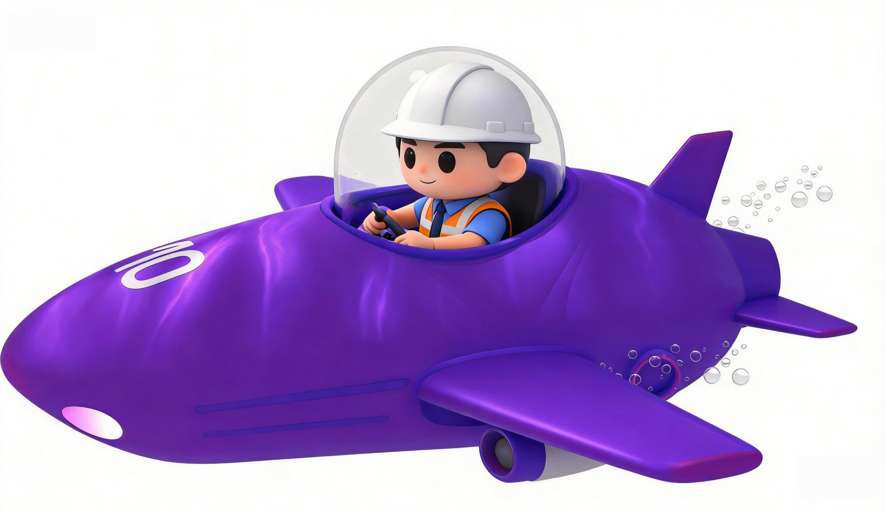
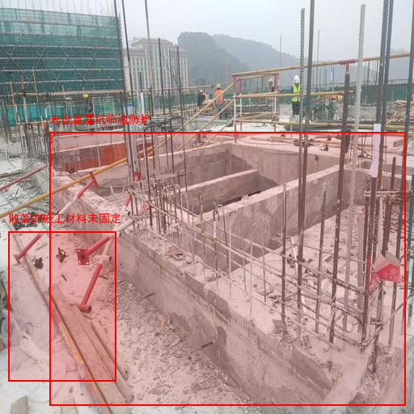
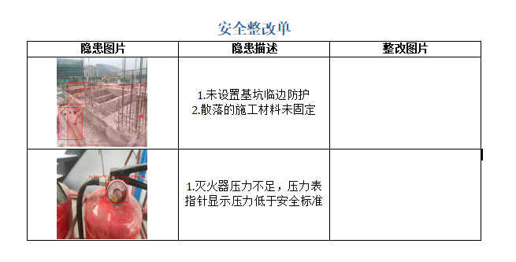
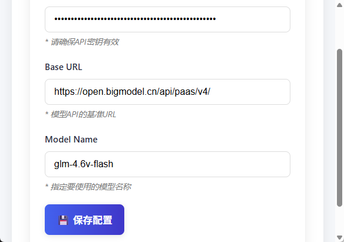
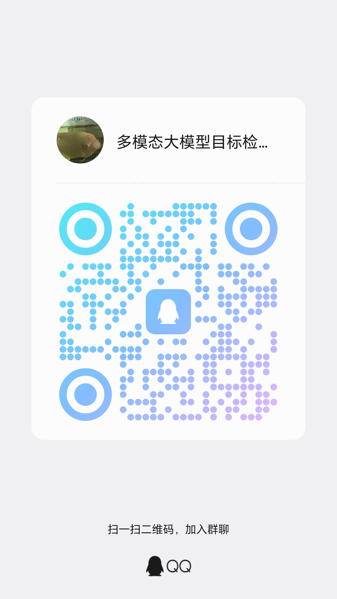

<div align="center">

</img> 

**Multi-modal safety hazard detection and rectification single generation tool**

  <strong>[中文](./README_zh.md) |
  English</strong>

## 📖 Introduction

In construction sites, wearing helmets, safety lines and using scaffolding are the most basic protective measures.  
Traditional industrial object‑detection algorithms such as DAMOYOLO can first detect human heads and then determine whether a helmet is worn, but their applicability is limited: they only recognise fixed categories and lack generalisation to complex scenarios (e.g., ropes, scaffolds).


With the breakthrough of multimodal large models in vision‑plus‑language tasks, we can now:
- **Detect multiple safety hazards at once**—helmets, ropes, scaffolds, etc.—and draw corresponding bounding boxes.



- **Generate a complete remedy report**, drastically reducing the manual writing burden for site inspectors and supervisors.



SecureEye is built with the lightweight `pywebview` framework. It connects to model services via the OpenAI API, deliberately avoiding heavy third‑party packages such as OpenCV or PyTorch to keep the application light and stable.

---

## 📌 Quick Start

### 1️⃣ Get a Model API Key & Download the App

This tool requires a multimodal large model, so when choosing a service provider be sure it supports such models. We recommend starting with Zhipu’s multimodal models; other providers haven’t been tested yet.

- **Get your Zhipu API key**  
  https://docs.bigmodel.cn/cn/guide/start/quick-start

If you’re new to Zhipu, register here and receive a generous free token allowance:

- **Zhipu GLM Coding Subscription (for 20+ coding tools)**  
  https://www.bigmodel.cn/glm-coding?ic=F89Y7CG3GW

**Download the application:**  
*Baidu Cloud:* https://pan.baidu.com/s/19lUx-4LuChSGysTAcT1hLg?pwd=2fpx (extract code: `2fpx`)  
*Quark Cloud:* https://pan.quark.cn/s/f9d935f1b744 (extract code: `eVzd`)

---

### 2️⃣ Configure the Model

Upon launching, you’ll be taken to the model‑configuration page.



- **API Key** – obtained in step 1.  
- **Base URL** – for Zhipu: `https://open.bigmodel.cn/api/paas/v4/`. Other providers’ URLs can be found in their respective docs.  
- **Model** – must be a multimodal large model. Zhipu offers several, including GLM‑4.6V, GLM‑4.6V‑FlashX, GLM‑4.1V‑Thinking‑FlashX, GLM‑4.1V‑Thinking‑Flash, glm‑4.6v‑flash, etc.

After setting these values, click **Save Configuration**.

---

### 3️⃣ Generate the Remedy Report


Click the **Generate Safety Hazard Remedy Report** button, select one or more images (multi‑select supported), and wait while the model processes. A Word document (`docx`) containing the detection results will open automatically.

---

## 🚀 Local Deployment

```bash
python3 -m pip install --upgrade pip
pip install openai pillow python-docx pywebview
git clone https://github.com/xiaohuangpin/SecureEye
cd SecureEye
python3 main_web.py
```

---

### Supported Platforms

Currently only Windows is supported, and the system must have Edge’s web‑rendering component installed.

---

## 🔮 Future Improvements

1. Add an option to skip drawing bounding boxes for hazards.  
2. Refine the UI design.

---

## 🤝 Get in Touch

If you’re interested in multimodal large‑model object detection, feel free to join our chat group:



---


    