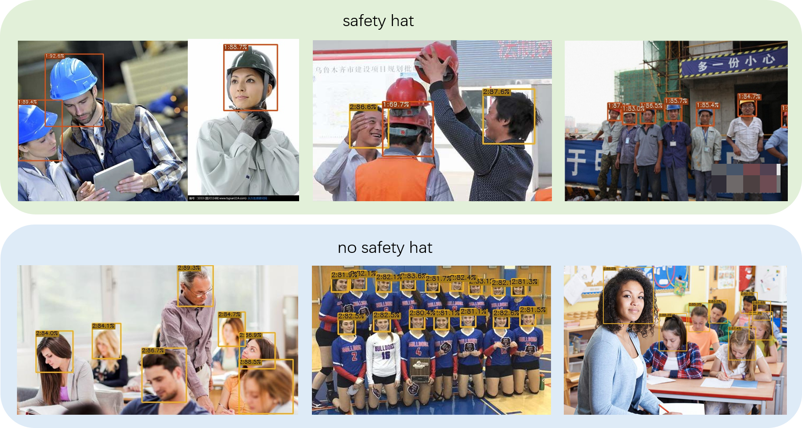
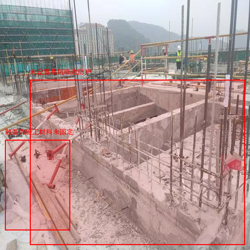
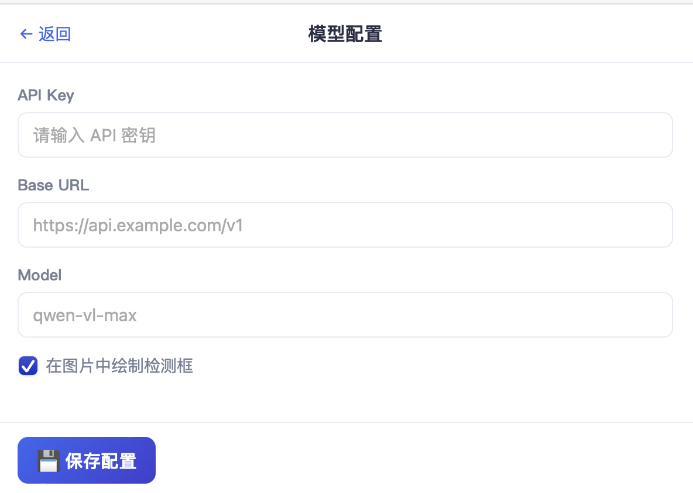
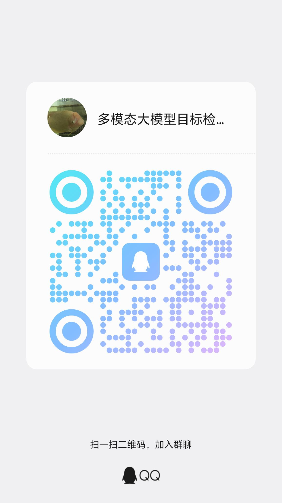

# 🛡️ SecureEye —— 用 AI 盯紧工地，让每一次违规作业都无处遁形

> **一句话看懂**：给工地拍张照，SecureEye 用 AI 自动找出**工人的不安全行为**（比如没挂安全带、没戴安全帽），并在图上圈出来、顺手帮你生成一份整改单——安全员再也不用一张张手抄报表了。

---

## ✨ 它解决什么问题？

在工地上，真正酿成事故的大多是**人的不安全行为**：

- 临边、高处作业却**没挂安全带**，或者安全带挂错了地方；
- 站在脚手架、升降平台护栏上**探身、冒险作业**；
- 高处作业安全带没有"高挂低用"；
- **不戴安全帽**，或者下颚带松松垮垮；
- 施工区不穿反光背心、不戴必要的防护用品……

过去靠安全员拿本子逐张拍照、手写整改单，效率低、易遗漏、标准还不统一。

**SecureEye 让这件事变得简单**：上传一张工地照片，AI 立刻"看懂"画面里工人在做什么，精准框出每一个危险动作，并直接为你整理成一份规范的整改单。

---

## 🤖 为什么用"多模态大模型"而不是传统检测算法？

传统目标检测（如 DAMOYOLO）通常只能识别**固定的几类物体**——比如先找到人头，再判断有没有戴帽子。它很难理解"工人在护栏上探身作业"这种**复杂的人的行为**，对绳索、脚手架等场景也缺乏泛化能力。



而多模态大模型具备"看图 + 理解语义"的能力，能够：

- 🔍 **一次性识别多种不安全行为**（未挂安全带、冒险攀爬、未戴安全帽等），并精准画出隐患边界框：



- 📝 **自动生成完整整改单**，大幅减少安全员和监理的重复撰写工作：


> 💡 **SecureEye 的设计原则**：用 `pywebview` 构建一个轻量、稳定的桌面应用，通过 OpenAI 兼容接口对接模型服务。**不依赖 OpenCV、PyTorch 这类重型第三方库**，降低安装负担与运行不稳定性，开箱即用。

---

## 🚀 快速开始

### 第一步：获取应用（下载或源码部署）

本应用必须调用多模态大模型，配置模型时请选择兼容 OpenAI 接口的模型服务（也支持本地部署的模型）。

**应用下载：**

- 百度网盘：https://pan.baidu.com/s/19lUx-4LuChSGysTAcT1hLg?pwd=2fpx （提取码：`2fpx`）
- 夸克网盘：https://pan.quark.cn/s/f9d935f1b744 （提取码：`eVzd`）

### 第二步：配置模型

打开应用会自动进入模型配置页。市面主流模型供应商大多兼容 OpenAI 接口，填入对应信息即可。



填好后点击**保存配置**。

### 第三步：生成整改单


点击**安全隐患检测**按钮，选择图片（支持多选）。检测完成后，系统会以表格形式展示每一个不安全行为，支持导出为word和excel表格。

---

## 💻 本地源码部署

```bash
python3 -m pip install --upgrade pip
pip install openai pillow python-docx pywebview
git clone https://github.com/xiaohuangpin/SecureEye
python3 main.py
```

---

## 🌐 Gradio 在线演示（无需安装桌面应用）

如果你只是想**快速体验**检测效果，不想安装桌面客户端，可以直接运行 Gradio 演示版。它用浏览器打开一个轻量网页，交互流程与桌面端一致：

- 📷 **多种图片来源**：支持本地上传、剪贴板粘贴、摄像头实时拍摄；
- 🖼️ **一键加载示例**：内置示例图片，点击即可尝试；
- 🚀 **开始检测**：左侧原图、右侧自动标注隐患边界框，并输出文字说明。


启动方式（需先配置 `.env` 中的 `api_key` / `base_url` / `model`）：

```bash
pip install gradio
python3 main.py
```

运行后浏览器会自动打开演示页面，上传或加载示例图片，点击**开始检测**即可查看识别结果。

---

## 🖥️ 支持平台

目前支持 **Windows** 系统，且需要系统中自带 **Edge 浏览器组件**（pywebview 运行依赖）。

---

## 🔍 SecureEye 重点识别的"不安全行为"

我们用专门优化的提示词，让模型把注意力集中在**工人自身的行为**上，而不是设备、材料或环境：

| 类别 | 典型违规示例 |
| --- | --- |
| 高处作业 / 临边作业 | 未佩戴或未正确挂扣安全带；安全带未"高挂低用" |
| 冒险站位 | 站在脚手架、平台、护栏、临边、洞口边缘作业 |
| 攀爬与倚靠 | 攀爬、跨越、倚靠、坐卧在护栏或不稳定位置 |
| 升降设备违规 | 在剪叉车、曲臂车上探身、站立护栏或超范围作业 |
| 个人防护（PPE） | 未戴安全帽 / 下颚带未系紧；未穿反光背心等 |

> 📌 模型只标注**明确可见、可判断**的违章行为；画面模糊、遮挡严重导致无法判断的情况不会误报，避免"冤枉"工人。

---

## 🗺️ 未来改进计划

- [ ] **开发对应的 Skill（技能插件）**：将 SecureEye 的"工地不安全行为检测 + 整改单生成"能力封装为可复用的 Skill，使其能无缝接入支持技能扩展的 AI 编程/智能体平台。目标包括：
  - 标准化输入/输出协议，让其他智能体一键调用本检测能力；
  - 内置专业安全巡查提示词与违规类型清单，开箱即用；
  - 支持在智能体工作流中自动触发检测并生成整改建议。

---

## 💬 联系我们

如果你对"多模态大模型 + 工地安全行为检测"感兴趣，欢迎扫码加入交流群：


