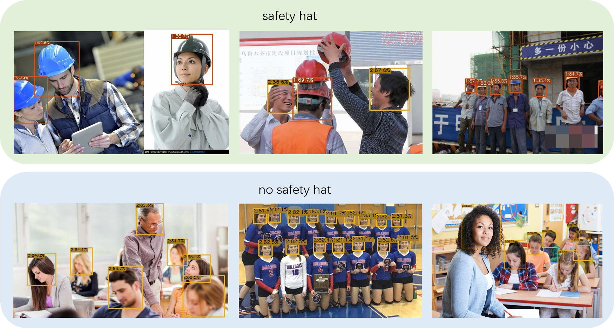
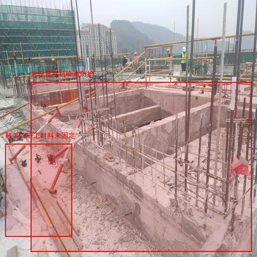
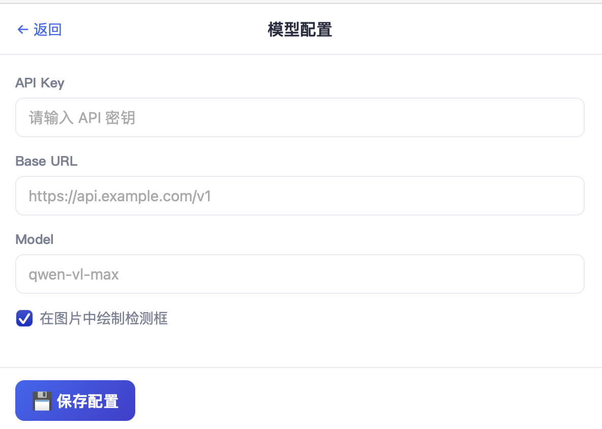
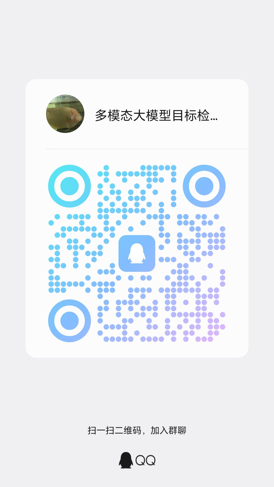

# 🛡️ SecureEye —— 用 AI 盯紧工地，让每一次违规作业都无处遁形

> **一句话看懂**：给工地拍张照，SecureEye 用 AI 自动找出**工人的不安全行为**（比如没挂安全带、没戴安全帽），并在图上圈出来、顺手帮你生成一份整改单——安全员再也不用一张张手抄报表了。

---

## 🎉 本次更新亮点

这一版我们把 SecureEye 从「一个桌面小工具」升级为「一套可复用、可扩展的安全巡检能力」，三处关键变化：

1. **🧩 检测能力封装为 Skill（SecureCV）**：用 Go 重写了核心检测逻辑，编译成单文件 `securecv.exe`，并以标准 `SKILL.md` / `skill.yml` 描述其输入输出。它不再只是一个 GUI 按钮，而是一个能被任意智能体「一键调用」的技能——丢进图片，返回边界框坐标 + 中文隐患描述 + 带红框标注的结果图。
2. **🖥️ 桌面框架由 pywebview 迁移到 PySide6**：pywebview 对异步（asyncio）兼容较差、且存在若干隐藏 Bug；我们改用生态健全、原生异步、更稳定的 **PySide6 + QFluentWidgets + qasync**，界面更流畅、崩溃更少、跨版本更可靠。
3. **✍️ 新增「系统提示词」自定义模块**：内置提示词聚焦「人的不安全行为」，但现在你可以像写代码一样，在专门的编辑页里**自定义角色设定与识别重点**，让模型去检测你关心的隐患（如动火作业未设监护人、有限空间未通风等），固定 JSON 输出模板由程序自动追加，保证结果始终可解析。

---

## ✨ 它解决什么问题？

在工地上，真正酿成事故的大多是**人的不安全行为**：

- 临边、高处作业却**没挂安全带**，或者安全带挂错了地方；
- 站在脚手架、升降平台护栏上**探身、冒险作业**；
- 高处作业安全带没有"高挂低用"；
- **不戴安全帽**，或者下颚带松松垮垮；
- 施工区不穿反光背心、不戴必要的防护用品……

过去靠安全员拿本子逐张拍照、手写整改单，效率低、易遗漏、标准还不统一。

**SecureEye 让这件事变得简单**：上传一张工地照片，AI 立刻"看懂"画面里工人在做什么，精准框出每一个危险动作，并直接为你整理成一份规范的整改单。

---

## 🤖 为什么用"多模态大模型"而不是传统检测算法？

传统目标检测（如 DAMOYOLO）通常只能识别**固定的几类物体**——比如先找到人头，再判断有没有戴帽子。它很难理解"工人在护栏上探身作业"这种**复杂的人的行为**，对绳索、脚手架等场景也缺乏泛化能力。



而多模态大模型具备"看图 + 理解语义"的能力，能够：

- 🔍 **一次性识别多种不安全行为**（未挂安全带、冒险攀爬、未戴安全帽等），并精准画出隐患边界框：



- 📝 **自动生成完整整改单**，大幅减少安全员和监理的重复撰写工作：


> 💡 **SecureEye 的设计原则**：用 **PySide6 + QFluentWidgets** 构建一个轻量、原生异步、稳定的桌面应用，通过 OpenAI 兼容接口对接模型服务。**不依赖 OpenCV、PyTorch 这类重型第三方库**，降低安装负担与运行不稳定性，开箱即用。

---

## 🧩 新亮点一：把检测能力封装成 Skill —— SecureCV

过去「隐患检测」只能在这个桌面应用里点按钮。现在，我们用 **Go 重写**了核心检测逻辑，编译为单文件可执行程序 `SecureCV_skill/bin/securecv.exe`，并用标准的 `SKILL.md` + `skill.yml` 描述它的输入/输出契约——它就变成了一个**可被任意智能体（Agent）一键调用的「技能」**。

- **纯 Go 实现，离线可构建**：依赖已 `go mod vendor` 落地，无 Python 运行时负担，一个 exe 走天下；
- **标准化输入输出**：输入单张/多张工地图片（本地路径或 http(s) 链接），stdout 返回结构化 JSON（`bbox_2d` 归一化坐标 + 中文 `label`），日志走 stderr，不污染结果；
- **内置专业提示词与降级链**：优先 `json_schema` 严格输出，服务端不支持时自动降级 `json_object`，解析失败再走正则兜底；
- **批量并发 + 单图容错**：批量推理限流并发，某张图失败只写入该条目 `error`，不中断整批。

**原图 → 技能结果图**（自动画出红框并标注中文隐患描述）：

| 原图 | Skill 标注结果 |
| --- | --- |
|  |  |

命令行一键调用（PowerShell）：

```powershell
$env:api_key="sk-xxxx"
$env:base_url="https://open.bigmodel.cn/api/paas/v4/"
$env:model="glm-4.6v-flash"

.\SecureCV_skill\bin\securecv.exe -check                      # 先做连通性自检
.\SecureCV_skill\bin\securecv.exe -pretty image\159.jpg        # 单图检测，JSON 输出到 stdout
.\SecureCV_skill\bin\securecv.exe -save out image\5.jpg image\6.jpg  # 批量检测并保存标注图
```

输出示例：

```json
[
  {
    "label": "1.工人临边作业未正确佩戴或挂扣安全带",
    "detections": [
      { "bbox_2d": [120, 85, 340, 290], "label": "工人临边作业未正确佩戴或挂扣安全带" }
    ]
  }
]
```

> 📌 `bbox_2d` 为 `[0,1000]` 归一化坐标，转像素需除以 1000 再乘图片宽高。详细参数与库调用方式见 [`SecureCV_skill/readme.md`](./SecureCV_skill/readme.md)、[`SecureCV_skill/SKILL.md`](./SecureCV_skill/SKILL.md) 与 [`SecureCV_skill/skill.yml`](./SecureCV_skill/skill.yml)。

---

## ✍️ 新亮点二：自定义「系统提示词」模块

不同工地、不同巡检任务关心的隐患并不一样。新版桌面应用新增了独立的**「系统提示词」页面**（采用 VSCode 风格纯文本编辑器，带行号、当前行高亮、自动缩进）：

- **只改「可编辑段」**：你可以自由编写**角色设定**与**重点识别行为**，例如把检测重点从「高处作业」切换到「动火作业 / 有限空间 / 临边防护」；
- **输出模板由程序固定追加**：无论你怎么改写提示词，结构化的 JSON 输出模板都会由核心自动拼接，保证模型输出始终可解析、可画框；
- **一键恢复默认**：随时点「恢复默认」回到内置的专业安全巡查提示词；`Ctrl+S` 保存、`Ctrl+Shift+D` 恢复，改动持久化到本地数据库。

> 💡 提示词写得越聚焦，模型检得越准。比如加入「重点检查动火作业前是否清理周边可燃物、是否配备灭火器与专人监护」，即可让模型针对动火场景专项排查。

---

## 🖥️ 新亮点三：桌面框架迁移 PySide6

我们从 `pywebview` 整体迁移到了 **PySide6 + QFluentWidgets + qasync** 技术栈：

| 对比项 | pywebview（旧） | PySide6（新） |
| --- | --- | --- |
| 异步兼容 | 与 asyncio 协作较差，回调链路易卡 | `qasync` 将 Qt 事件循环与 asyncio 统一，天然异步 |
| 稳定性 | 存在若干隐藏 Bug（白屏/僵死/关闭残留） | 生态成熟、版本迭代稳定 |
| 界面能力 | 依赖前端 HTML/CSS 拼接 | Fluent 风格原生控件，导航/表格/编辑页统一 |
| 数据与权限 | 无本地账号体系 | 内置 SQLite + scrypt 口令派生的本地账号/登录 |

> 一句话：同样的检测能力，跑在一个更流畅、更稳定、可长期维护的桌面壳子里。

---

## 🚀 快速开始

### 第一步：获取应用（下载或源码部署）

本应用必须调用多模态大模型，配置模型时请选择兼容 OpenAI 接口的模型服务（也支持本地部署的模型）。

**应用下载：**

- 百度网盘：https://pan.baidu.com/s/19lUx-4LuChSGysTAcT1hLg?pwd=2fpx （提取码：`2fpx`）
- 夸克网盘：https://pan.quark.cn/s/f9d935f1b744 （提取码：`eVzd`）

### 第二步：配置模型

打开应用会自动进入模型配置页。市面主流模型供应商大多兼容 OpenAI 接口，填入对应信息即可。



填好后点击**保存配置**。

### 第三步：生成整改单


点击**安全隐患检测**按钮，选择图片（支持多选）。检测完成后，系统会以表格形式展示每一个不安全行为，支持导出为word和excel表格。

---

## 💻 本地源码部署

桌面端（PySide6）：

```bash
python3 -m pip install --upgrade pip
pip install openai pillow python-docx pyside6 pyside6-fluent-widgets qasync python-dotenv
git clone https://github.com/xiaohuangpin/SecureEye
cd SecureEye
python main_GUI.py
```

SecureCV Skill（Go，可选）：

```bash
cd SecureCV_skill/src
 go build -mod=vendor -o ../bin/securecv ./cmd/securecv   # Windows 产物为 securecv.exe
```

> 项目推荐使用 `uv` 管理依赖，直接 `uv sync` 后 `uv run python main_GUI.py` 即可启动。

---

## 🌐 Gradio 在线演示（无需安装桌面应用）

如果你只是想**快速体验**检测效果，不想安装桌面客户端，可以直接运行 Gradio 演示版。它用浏览器打开一个轻量网页，交互流程与桌面端一致：

- 📷 **多种图片来源**：支持本地上传、剪贴板粘贴、摄像头实时拍摄；
- 🖼️ **一键加载示例**：内置示例图片，点击即可尝试；
- 🚀 **开始检测**：左侧原图、右侧自动标注隐患边界框，并输出文字说明。


启动方式（需先配置 `.env` 中的 `api_key` / `base_url` / `model`）：

```bash
pip install gradio
python3 main.py
```

运行后浏览器会自动打开演示页面，上传或加载示例图片，点击**开始检测**即可查看识别结果。

---

## 🖥️ 支持平台

- **桌面应用**：基于 PySide6，支持 **Windows**（ Linux / macOS 兼容 Qt 阵营，可自行验证）；相比旧版不再依赖 Edge WebView2 运行环境；
- **SecureCV Skill**：单文件 `securecv` 可执行程序，Windows / Linux / macOS 均可编译运行；
- **Gradio 在线版**：仅需浏览器，跨平台。

---

## 🔍 SecureEye 重点识别的"不安全行为"

我们用专门优化的提示词，让模型把注意力集中在**工人自身的行为**上，而不是设备、材料或环境：

| 类别 | 典型违规示例 |
| --- | --- |
| 高处作业 / 临边作业 | 未佩戴或未正确挂扣安全带；安全带未"高挂低用" |
| 冒险站位 | 站在脚手架、平台、护栏、临边、洞口边缘作业 |
| 攀爬与倚靠 | 攀爬、跨越、倚靠、坐卧在护栏或不稳定位置 |
| 升降设备违规 | 在剪叉车、曲臂车上探身、站立护栏或超范围作业 |
| 个人防护（PPE） | 未戴安全帽 / 下颚带未系紧；未穿反光背心等 |

> 📌 模型只标注**明确可见、可判断**的违章行为；画面模糊、遮挡严重导致无法判断的情况不会误报，避免"冤枉"工人。

---

## 🗺️ 未来改进计划

- [x] **开发对应的 Skill（技能插件）**：已将“工地不安全行为检测 + 结果标注”能力用 Go 封装为可复用的 SecureCV Skill，支持智能体一键调用（已完成）；
- [x] **提示词自定义**：已支持在“系统提示词”页面自定义检测重点（已完成）；
- [ ] 持续扩充违规类型清单与场景化提示词模板库；
- [ ] 在智能体工作流中自动触发检测并直接生成整改建议。

---

## 💬 联系我们

如果你对"多模态大模型 + 工地安全行为检测"感兴趣，欢迎扫码加入交流群：


